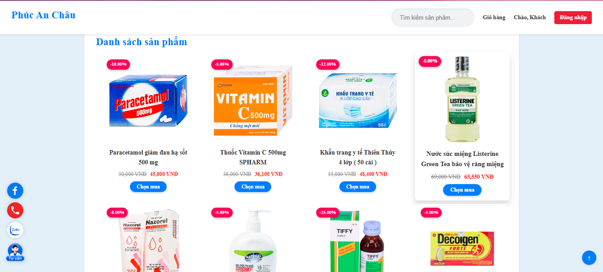
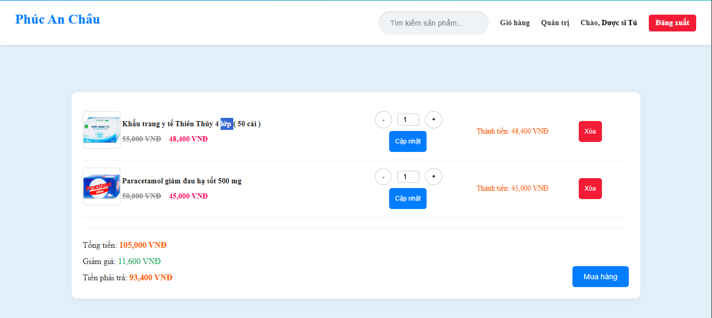
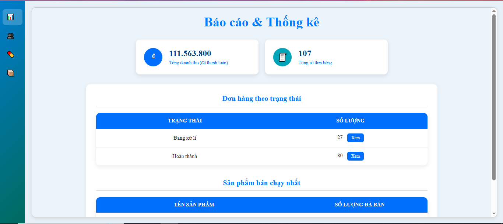

# 💊 Phuc An Chau Pharmacy | E-Commerce Website

<p align="center">
  
  
  
  
  
</p>

---


## 📖 Overview

**Phuc An Chau Pharmacy** is a full-stack web application that simulates an online pharmacy system.
It allows users to browse, search, and purchase pharmaceutical products while enabling administrators to manage the entire system efficiently.

---

Link web : nhathuocphucanchau.kesug.com

---

## ✨ Key Features

### 👤 User Features

* 🔐 Authentication (Register/Login)
* 🔍 Smart product search (case-insensitive)
* 🛒 Add to cart & manage cart
* 💳 Checkout & payment simulation (QR / ATM)
* 📧 Email confirmation (PHPMailer)
* 💬 Real-time chat with pharmacist (Pusher)
* 📦 Order history tracking

---

### 🛠️ Admin Features

* 📦 Product management (CRUD)
* 👥 User management
* 📊 Revenue statistics dashboard
* 🧾 Order management system
* 💬 Customer support chat

---

## 🖼️ Screenshots

home page


product page



cart page



admin page



---

## 🏗️ Tech Stack

| Layer    | Technology            |
| -------- | --------------------- |
| Frontend | HTML, CSS, JavaScript |
| Backend  | PHP                   |
| Database | MySQL                 |
| Realtime | Pusher                |
| Email    | PHPMailer             |
| Server   | XAMPP / InfinityFree  |

---

## 📂 Project Structure

```bash
PhucAnChauPharmacy/
│── admin/          # Admin dashboard
│── assets/         # CSS, JS, images
│── config/         # Database config
│── includes/       # Core logic
│── pages/          # Main pages
│── database/       # SQL file
│── index.php
```

---

## ⚙️ Installation

### 1️⃣ Clone repository

```bash
git clone https://github.com/Tantu-It/PhucAnChauPharmacy.git
```

### 2️⃣ Setup database

* Import `.sql` file into MySQL

### 3️⃣ Run project

* Move project to `htdocs`
* Start XAMPP
* Open:

```
http://localhost/PhucAnChauPharmacy
```


## 📌 How to Contribute

```bash
git checkout -b feature-new
git commit -m "feat: add new feature"
git push origin feature-new
```

---

## ⭐ Support

If you find this project useful, please give it a ⭐ on GitHub!

---

## 📬 Contact

For any inquiries or feedback, feel free to reach out.

---
